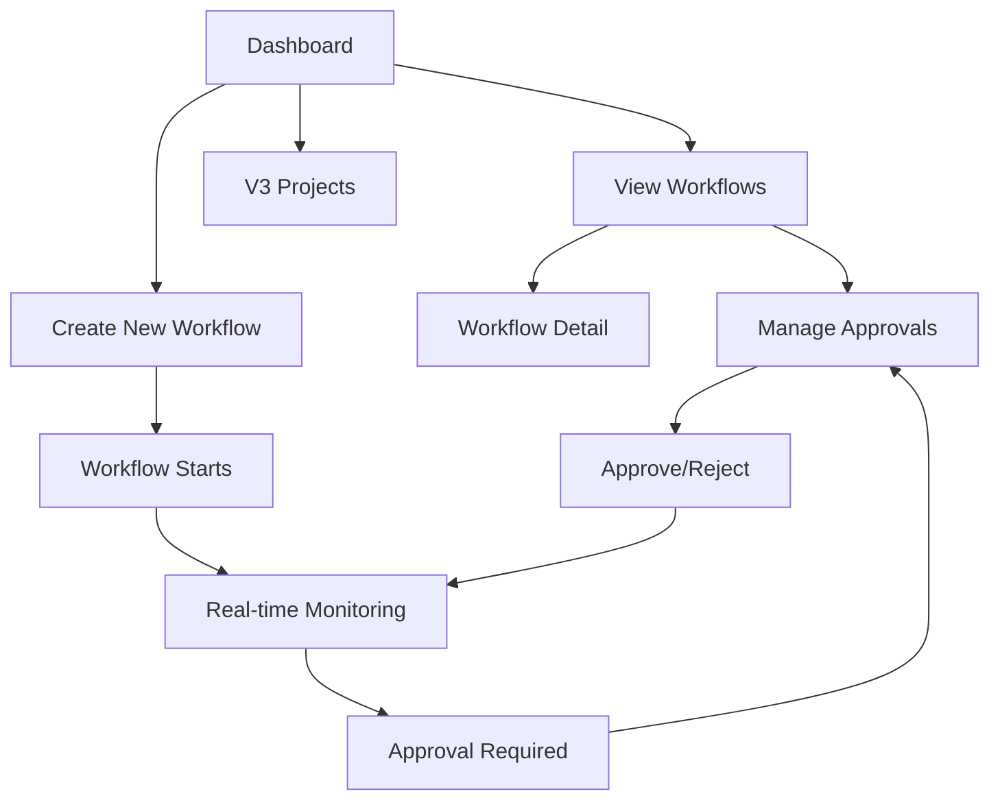

## 1. Product Overview
TUTOR是一个智能研究自动化工作流平台，支持从研究想法生成到论文撰写的完整流程。目标用户是科研人员、学术研究者和学生，提供AI驱动的研究自动化工具。

## 2. Core Features

### 2.1 User Roles
| Role | Registration Method | Core Permissions |
|------|---------------------|------------------|
| Researcher | Local access | Full access to all features |

### 2.2 Feature Module
1. **Dashboard**: Workflow overview, stats, recent activities
2. **V3 Dashboard**: Project management for V3 research projects
3. **Workflows**: List, manage, and monitor all workflow runs
4. **Approvals**: Approval request management
5. **Workflow Detail**: Detailed view of individual workflow runs
6. **New Workflow**: Create and start new workflow runs
7. **Settings**: Application settings

### 2.3 Page Details
| Page Name | Module Name | Feature description |
|-----------|-------------|---------------------|
| Dashboard | Stats grid | Display workflow statistics with visual cards |
| Dashboard | Recent workflows | Show latest workflow runs in a table |
| V3 Dashboard | Project list | Display all V3 research projects with filtering |
| V3 Dashboard | Create project | Modal for creating new V3 projects |
| V3 Dashboard | Project actions | Archive, favorite, delete, add notes to projects |
| Workflows | Workflow grid | Card-based display of all workflow runs |
| Workflows | Filter bar | Status and type filtering |
| Workflows | Pagination | Navigate through multiple pages of workflows |
| Workflows | Batch actions | Batch delete and cleanup operations |
| Approvals | Approval list | Display all approval requests |
| Approvals | Action buttons | Approve or reject approval requests |
| Approvals | Context preview | Show relevant context data for approvals |
| Workflow Detail | Run information | Detailed information about workflow run |
| New Workflow | Form | Form to create new workflow runs |
| Settings | Configuration | Application settings configuration |

## 3. Core Process
Users navigate through the dashboard to view overall statistics, then can either view existing workflows, create new ones, or manage V3 projects. Workflows run in the background with real-time status updates, and may require user approval at certain stages.

## 4. User Interface Design

### 4.1 Design Style
- **Colors**: Dark theme with deep navy background (#0a1628), electric blue accents (#3b82f6), and vibrant accent colors for status indicators
- **Button style**: Rounded buttons with smooth hover transitions, subtle shadows for depth
- **Font and sizes**: Inter for body text, Poppins for headings; 14px/16px body, 24px/32px headings
- **Layout style**: Card-based with generous spacing, glass-morphism effects on modal overlays
- **Icon style**: Lucide icons with consistent stroke width, animated on hover

### 4.2 Page Design Overview
| Page Name | Module Name | UI Elements |
|-----------|-------------|-------------|
| Dashboard | Stats grid | Gradient-filled stat cards with floating animations, icon backgrounds |
| Dashboard | Recent workflows | Clean table with hover row highlights, status badges with color coding |
| V3 Dashboard | Project grid | Cards with project previews, status indicators, interactive action menus |
| V3 Dashboard | Create modal | Glass-morphism design with smooth transitions, form validation states |
| Workflows | Filter bar | Styled select elements with custom dropdowns, refresh button with spin animation |
| Workflows | Workflow cards | Hover lift effect, status badges with pulse animation for running workflows |
| Approvals | Approval cards | Detailed context previews, prominent action buttons with confirmation states |

### 4.3 Responsiveness
Desktop-first design with responsive breakpoints at 1024px, 768px, and 480px. Touch-optimized for mobile devices with larger tap targets and simplified navigation.

### 4.4 Animations & Micro-interactions
- Page load animations with staggered fade-in
- Hover states with scale and shadow effects
- Loading indicators with smooth pulsing
- Modal transitions with slide-up and fade
- Status badge animations for real-time updates
