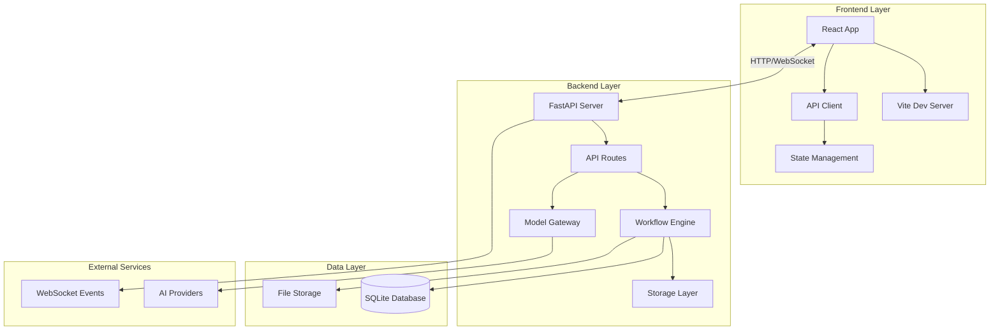
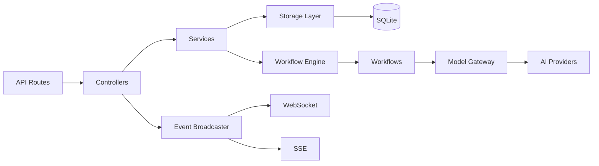
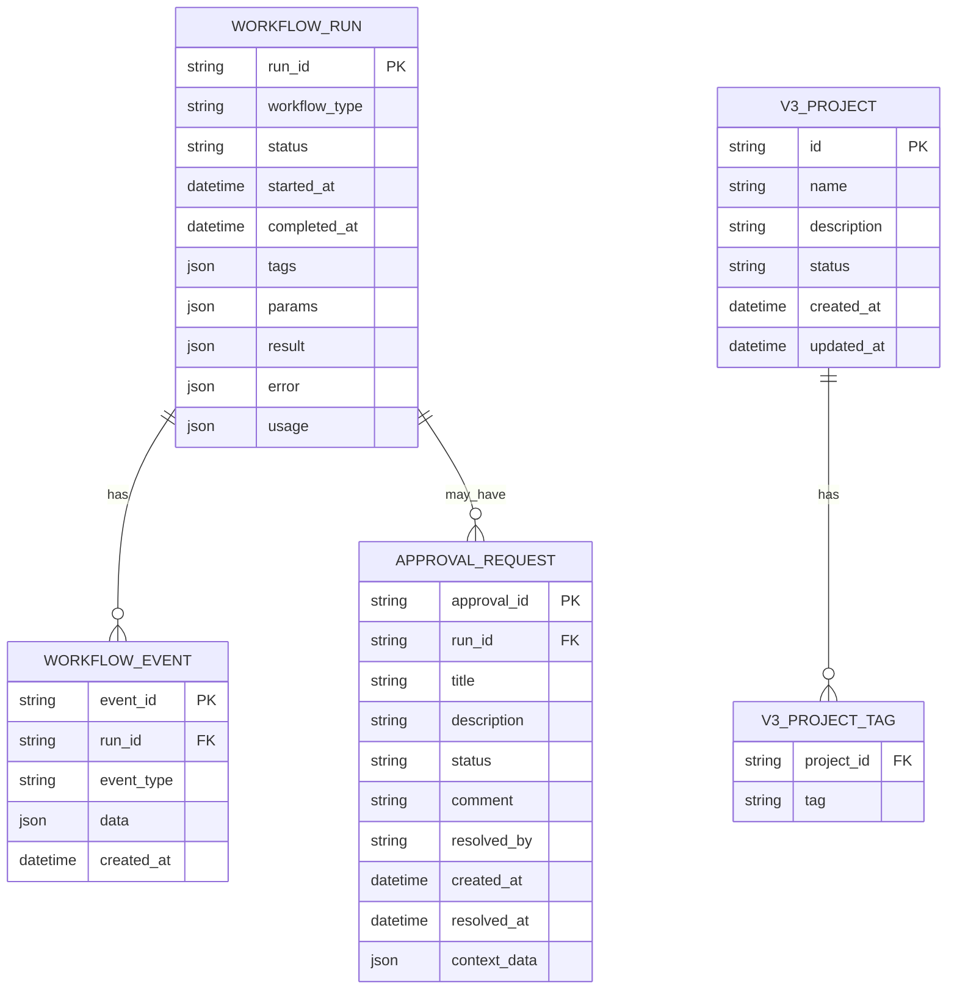

## 1. Architecture Design



## 2. Technology Description
- **Frontend**: React@18 + Vite + CSS Modules
- **Initialization Tool**: Vite
- **Backend**: FastAPI@0.104+ + Python 3.9+
- **Database**: SQLite with custom storage layer
- **Real-time**: WebSocket + SSE (Server-Sent Events)

## 3. Route Definitions

| Route | Purpose |
|-------|---------|
| / | Dashboard with overview and recent workflows |
| /v3 | V3 project management dashboard |
| /workflows | Workflow list and management |
| /workflows/new | Create new workflow |
| /workflows/:id | Detailed workflow view |
| /approvals | Approval request management |
| /settings | Application settings |

## 4. API Definitions

### 4.1 Frontend API Client

```typescript
// API Response Types
interface SuccessResponse<T> {
  success: boolean;
  data: T;
  meta?: {
    total: number;
    limit: number;
    offset: number;
    has_more: boolean;
  };
}

interface ErrorResponse {
  success: boolean;
  error: {
    message: string;
    code?: string;
  };
}

// Project Types
interface V3Project {
  id: string;
  name: string;
  description?: string;
  status: string;
  tags: string[];
  created_at: string;
  updated_at: string;
}

// Workflow Types
interface WorkflowRun {
  run_id: string;
  workflow_type: string;
  status: string;
  started_at?: string;
  completed_at?: string;
  tags: string[];
  params: Record<string, any>;
}

// Approval Types
interface ApprovalRequest {
  approval_id: string;
  run_id: string;
  title: string;
  description?: string;
  status: string;
  created_at: string;
  context_data?: Record<string, any>;
}
```

### 4.2 Backend API Endpoints

```
# Health
GET /health

# Workflows
POST /api/v1/workflows/run
GET /api/v1/workflows
GET /api/v1/workflows/{run_id}
DELETE /api/v1/workflows/{run_id}
POST /api/v1/workflows/{run_id}/retry
POST /api/v1/workflows/{run_id}/cancel
PATCH /api/v1/workflows/{run_id}/tags
POST /api/v1/workflows/batch-delete
DELETE /api/v1/workflows/cleanup
GET /api/v1/workflows/stats

# Approvals
GET /api/v1/workflows/approvals
GET /api/v1/workflows/approvals/pending
GET /api/v1/workflows/approvals/{approval_id}
POST /api/v1/workflows/approvals/{approval_id}/approve
POST /api/v1/workflows/approvals/{approval_id}/reject
POST /api/v1/workflows/approvals/{approval_id}/cancel

# V3 Projects
POST /api/v3/projects
GET /api/v3/projects
GET /api/v3/projects/{project_id}
PUT /api/v3/projects/{project_id}
DELETE /api/v3/projects/{project_id}
GET /api/v3/projects/{project_id}/conversations
PATCH /api/v3/projects/{project_id}/tags
GET /api/v3/projects/list/archived
GET /api/v3/projects/list/favorites
GET /api/v3/projects/roles/list

# Uploads
POST /api/v1/uploads
POST /api/v1/uploads/multiple
GET /api/v1/uploads
DELETE /api/v1/uploads/{file_id}

# WebSocket
WS /api/v1/ws/projects/{project_id}
SSE /api/v1/events/{run_id}
```

## 5. Server Architecture Diagram



## 6. Data Model

### 6.1 Data Model Definition



### 6.2 Data Definition Language

```sql
-- Workflow Runs Table
CREATE TABLE IF NOT EXISTS workflow_runs (
    run_id TEXT PRIMARY KEY,
    workflow_type TEXT NOT NULL,
    status TEXT NOT NULL DEFAULT 'pending',
    started_at TEXT,
    completed_at TEXT,
    tags TEXT DEFAULT '[]',
    params TEXT DEFAULT '{}',
    result TEXT,
    error TEXT,
    usage TEXT,
    created_at TEXT DEFAULT CURRENT_TIMESTAMP,
    updated_at TEXT DEFAULT CURRENT_TIMESTAMP
);

-- Workflow Events Table
CREATE TABLE IF NOT EXISTS workflow_events (
    event_id TEXT PRIMARY KEY,
    run_id TEXT NOT NULL,
    event_type TEXT NOT NULL,
    data TEXT DEFAULT '{}',
    created_at TEXT DEFAULT CURRENT_TIMESTAMP,
    FOREIGN KEY (run_id) REFERENCES workflow_runs(run_id)
);

-- Approval Requests Table
CREATE TABLE IF NOT EXISTS approval_requests (
    approval_id TEXT PRIMARY KEY,
    run_id TEXT NOT NULL,
    title TEXT NOT NULL,
    description TEXT,
    status TEXT NOT NULL DEFAULT 'pending',
    comment TEXT,
    resolved_by TEXT,
    created_at TEXT DEFAULT CURRENT_TIMESTAMP,
    resolved_at TEXT,
    context_data TEXT DEFAULT '{}',
    FOREIGN KEY (run_id) REFERENCES workflow_runs(run_id)
);

-- V3 Projects Table
CREATE TABLE IF NOT EXISTS v3_projects (
    id TEXT PRIMARY KEY,
    name TEXT NOT NULL,
    description TEXT,
    status TEXT NOT NULL DEFAULT 'idea',
    created_at TEXT DEFAULT CURRENT_TIMESTAMP,
    updated_at TEXT DEFAULT CURRENT_TIMESTAMP
);

-- V3 Project Tags Table
CREATE TABLE IF NOT EXISTS v3_project_tags (
    project_id TEXT NOT NULL,
    tag TEXT NOT NULL,
    PRIMARY KEY (project_id, tag),
    FOREIGN KEY (project_id) REFERENCES v3_projects(id)
);

-- Indexes
CREATE INDEX IF NOT EXISTS idx_workflow_runs_status ON workflow_runs(status);
CREATE INDEX IF NOT EXISTS idx_workflow_runs_workflow_type ON workflow_runs(workflow_type);
CREATE INDEX IF NOT EXISTS idx_workflow_events_run_id ON workflow_events(run_id);
CREATE INDEX IF NOT EXISTS idx_approval_requests_run_id ON approval_requests(run_id);
CREATE INDEX IF NOT EXISTS idx_approval_requests_status ON approval_requests(status);
CREATE INDEX IF NOT EXISTS idx_v3_projects_status ON v3_projects(status);
CREATE INDEX IF NOT EXISTS idx_v3_project_tags_project_id ON v3_project_tags(project_id);
```
